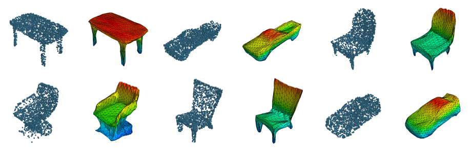
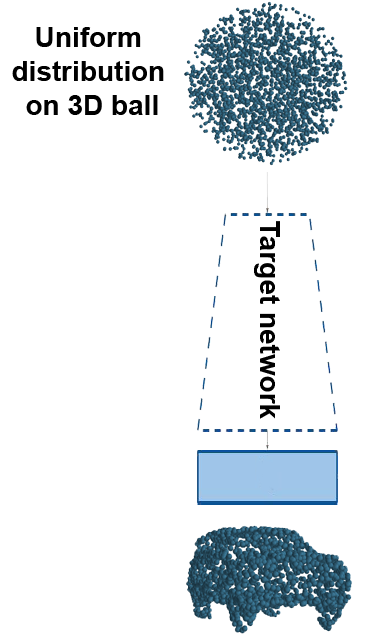
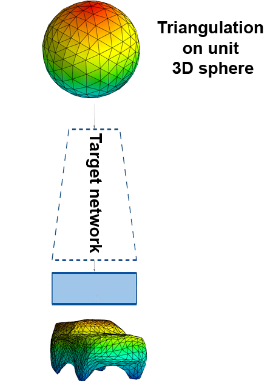

# Autoencoders with Hyper and Target Networks for Compact Representations of 3D Point Clouds

Authors: Przemysław Spurek, Sebastian Winczowski, Jacek Tabor, Maciej Zamorski, Maciej Zįeba, Tomasz Trzcínski



| arXiv |
| :---- |
| [Hypernetwork approach to generating point clouds (abs)](https://arxiv.org/abs/2003.00802) |
| [Hypernetwork approach to generating point clouds (pdf)](https://arxiv.org/pdf/2003.00802.pdf) |

| ICML 2020 |
| :--- |
| [Hypernetwork approach to generating point clouds (abs)](http://proceedings.mlr.press/v119/spurek20a.html) |
| [Hypernetwork approach to generating point clouds (pdf)](http://proceedings.mlr.press/v119/spurek20a/spurek20a.pdf) |


#### Abstract
In this work, we propose a novel method for generating 3D point clouds that leverage properties of hyper networks. 
Contrary to the existing methods that learn only the representation of a 3D object,our approach simultaneously finds a 
representation of the object and its 3D surface. The main idea of our HyperCloud method is to build a hyper network that
returns weights of a particular neural network (target network) trained to map points from a uniform unit ball 
distribution into a 3D shape. As a consequence, a particular 3D shape can be generated using point-by-point sampling 
from the assumed prior distribution and transform-ing sampled points with the target network. Since the hyper network is
based on an auto-encoder architecture  trained  to  reconstruct  realistic  3D shapes, the target network weights can 
be considered a parametrization of the surface of a 3D shape, and not a standard representation of point cloud usually 
returned by competitive approaches.The proposed architecture allows finding mesh-based representation of 3D objects in a
 generative manner while providing point clouds en pair in quality with the state-of-the-art methods.

## Requirements
- dependencies stored in `requirements.txt`.
- Python 3.6+
- cuda

## Installation
If you are using `Conda`:
- run `./install_requirements.sh` 

otherwise:
- install `cudatoolkit` and run `pip install -r requirements.txt`

Then execute:
```
export CUDA_HOME=... # e.g. /var/lib/cuda-10.0/
./build_losses.sh
```

### Configuration (settings/hyperparams.json, settings/experiments.json):
  - *arch* -> aae | vae
  - *target_network_input:normalization:type* -> progressive
  - *target_network_input:normalization:epoch* -> epoch for which the progressive normalization, of the points from uniform distribution, ends
  - *reconstruction_loss* -> chamfer | earth_mover
  - *dataset* -> shapenet


#### Frequency of saving training data (settings/hyperparams.json)
```
"save_weights_frequency": int (> 0) -> save model's weights every x epochs
"save_samples_frequency": int (> 0) -> save intermediate reconstructions every x epochs
```


## Target Network input

#### Uniform distribution:
3D points are sampled from uniform distribution. 

###### Normalization
When normalization is enabled, points are normalized progressively 
from first epoch to `target_network_input:normalization:epoch` epoch specified in the configuration. 

As a result, for epochs >= `target_network_input:normalization:epoch`, target network input is sampled from a uniform unit 3D ball 

Exemplary config:
```
"target_network_input": {
    "constant": false,
    "normalization": {
        "enable": true,
        "type": "progressive",
        "epoch": 100
    }
}
For epochs: [1, 100] target network input is normalized progressively
For epochs: [100, inf] target network input is sampled from a uniform unit 3D ball
``` 


## Usage
**Add project root directory to PYTHONPATH**

```export PYTHONPATH=project_path:$PYTHONPATH```

### Training
`python experiments/train_[aae|vae].py --config settings/hyperparams.json`

Results will be saved in the directory: 
`${results_root}/[aae|vae]/training/uniform*/${dataset}/${classes}`


### Experiments
`python experiments/experiments.py --config settings/experiments.json`

Results will be saved in the directory: 
`${results_root}/[aae|vae]/experiments/uniform*/${dataset}/${classes}`

Model weights are loaded from path:
  - ${weights_path} if specified
  - otherwise: ${results_root}/${arch}/training/.../weights (make sure that `target_network_input` and `classes` are the
   same in the `hyperparams.json`/`experiments.json`)
   
###### Sphere distribution:


The following experiments provide input of the target network as samples from a triangulation on a unit 3D sphere: 
- `sphere_triangles` 
- `sphere_triangles_interpolation` 

3D points are sampled uniformly from the triangulation on a unit 3D sphere.

Available methods: `hybrid | hybrid2 | hybrid3 | midpoint | midpoint2 | centroid | edge`


### Compute metrics
`python experiments/compute_metrics.py --config settings/experiments.json`

Model weights are loaded from path:
  - ${weights_path} if specified
  - otherwise: ${results_root}/${arch}/training/.../weights (make sure that `target_network_input` and `classes` are the
   same in the `hyperparams.json`/`experiments.json`)
  
### Shapenet dataset classes
Classes can be specified in the hyperparams/experiments file in the **classes** key
```
airplane,  bag,        basket,     bathtub,   bed,        bench, 
bicycle,   birdhouse,  bookshelf,  bottle,    bowl,       bus,      
cabinet,   can,        camera,     cap,       car,        chair,    
clock,     dishwasher, monitor,    table,     telephone,  tin_can,  
tower,     train,      keyboard,   earphone,  faucet,     file,     
guitar,    helmet,     jar,        knife,     lamp,       laptop,   
speaker,   mailbox,    microphone, microwave, motorcycle, mug,      
piano,     pillow,     pistol,     pot,       printer,    remote_control,      
rifle,     rocket,     skateboard, sofa,      stove,      vessel,   
washer,    boat,       cellphone
```
### License
This implementation is licensed under the MIT License
